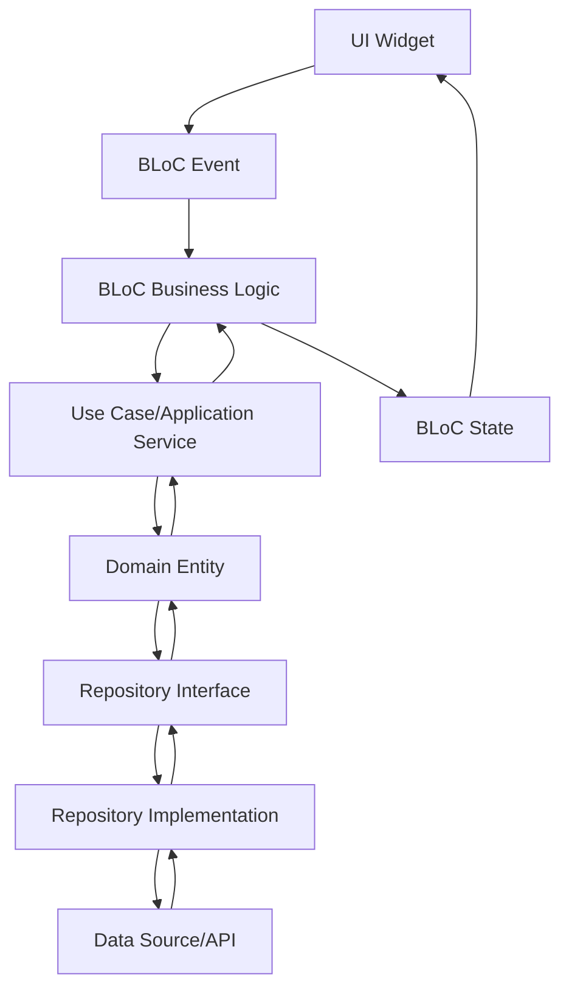

# Arquitectura del Sistema

## 🏗️ Visión General

Escienza Boletas está construido siguiendo los principios de **Domain Driven Design (DDD)** combinado con el patrón **BLoC** para la gestión de estado, proporcionando una arquitectura robusta, escalable y mantenible centrada en el dominio del negocio.

## 📐 Principios Arquitectónicos

### Domain Driven Design (DDD)
La aplicación está organizada en capas que respetan la separación entre dominio y aplicación:

```
┌─────────────────────────────────────┐
│           Presentation              │  ← UI, BLoCs, Widgets
├─────────────────────────────────────┤
│           Application               │  ← Use Cases, Application Services
├─────────────────────────────────────┤
│            Domain                   │  ← Entities, Value Objects, Domain Services
├─────────────────────────────────────┤
│         Infrastructure              │  ← Repositories Impl, External Services
└─────────────────────────────────────┘
```

### Elementos DDD Implementados

#### 1. **Domain Entities**
- Entidades centrales del negocio (Turno, Document, Transaction, etc.)
- Lógica de negocio encapsulada
- Identidad única y comportamientos propios

#### 2. **Value Objects**
- Objetos inmutables que describen aspectos del dominio
- Validaciones de dominio incorporadas
- Email, Password, DocumentId, etc.

#### 3. **Repository Pattern**
- Abstracción del acceso a datos
- Contrato definido en el dominio
- Implementación en infraestructura

#### 4. **Application Services (Use Cases)**
- Orquestación de operaciones de dominio
- Casos de uso específicos del negocio
- Coordinación entre entidades y repositorios

### Patrones de Diseño Implementados

#### 1. **BLoC Pattern (Business Logic Component)**
- Separación completa entre UI y lógica de aplicación
- Gestión de estado predecible y testeable
- Manejo de eventos y estados reactivos

#### 2. **Repository Pattern**
- Abstracción de fuentes de datos definida en el dominio
- Implementación en la capa de infraestructura
- Facilita testing con mocks

#### 3. **Dependency Injection**
- Inversión de control usando RepositoryProvider
- Facilita testing y mantenimiento
- Desacoplamiento entre capas

#### 4. **Use Cases (Application Services)**
- Encapsulan lógica de aplicación específica
- Coordinan operaciones entre dominio e infraestructura
- Un use case por operación de negocio

## 📦 Estructura de Packages

### Utility Packages

#### `edsuite_common/`
```
lib/
├── edsuite_common.dart   # Export principal
└── src/
    ├── src.dart          # Exports internos
    ├── helpers/          # Utilidades y helpers
    ├── dialogs/          # Diálogos reutilizables
    └── widgets/          # Widgets reutilizables
```

**Responsabilidades:**
- Widgets reutilizables across features
- Utilidades y helpers generales
- Diálogos y componentes UI comunes
- Funcionalidades transversales de la aplicación

## 🔄 Flujo de Datos DDD

### 1. Flujo Típico en DDD




## 📈 Beneficios de la Arquitectura DDD

### ✅ Enfoque en el Dominio
- Código que refleja el lenguaje del negocio
- Lógica de negocio centralizada y protegida
- Colaboración efectiva con domain experts

### ✅ Mantenibilidad
- Separación clara entre capas
- Cambios en infraestructura no afectan el dominio
- Evolución independiente de cada bounded context

### ✅ Testabilidad
- Domain logic aislada y testeable
- Mocking sencillo de dependencias externas
- Tests unitarios focalizados en reglas de negocio

### ✅ Escalabilidad
- Nuevos bounded contexts independientes
- Microservicios preparados por contexto
- Crecimiento modular y controlado


## 🎨 Convenciones de Naming DDD

### Archivos y Carpetas
- `snake_case` para archivos y carpetas
- Sufijos que reflejan el patrón DDD:
  - `_usecases.dart` para Application Services
  - `_repository.dart` para implementaciones
  - `i_[name]_repository.dart` para interfaces
  - `_bloc.dart` para BLoCs de presentación

### Clases y Métodos
- `PascalCase` para clases siguiendo ubiquitous language
- `camelCase` para métodos que expresan acciones del dominio
- Nombres que reflejan operaciones de negocio reales
- Evitar términos técnicos en favor del lenguaje del dominio

### Use Cases y Application Services
- `[Context]Usecases` para servicios de aplicación
- Métodos que representan casos de uso específicos
- `SignUsecases.signIn()`, `DocumentsUsecases.getMyCompanies()`

### Repository Pattern
- `I[Name]Repository` para interfaces del dominio
- `[Name]Repository` para implementaciones
- Métodos que abstraen operaciones de persistencia