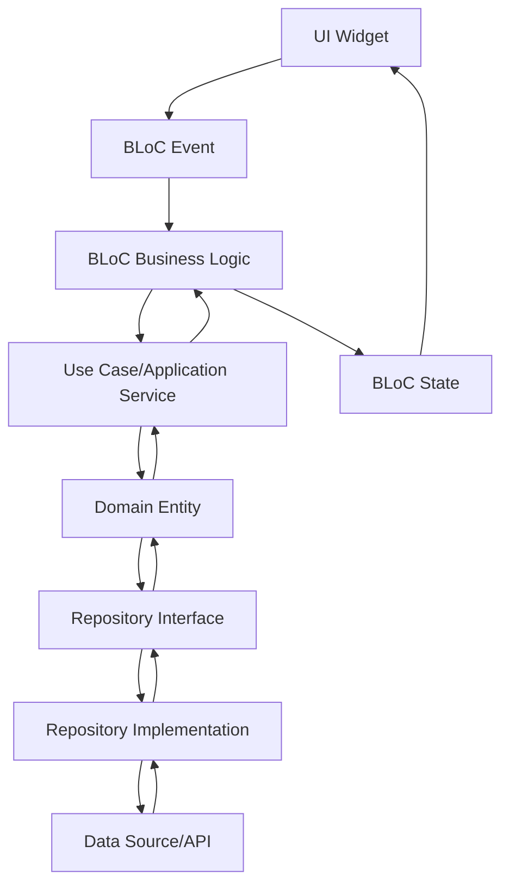

# System Architecture

## 🏗️ Overview

Escienza Boletas is built following the principles of **Domain Driven Design (DDD)** combined with the **BLoC** pattern for state management, providing a robust, scalable, and maintainable architecture focused on business domain.

## 📐 Architectural Principles

### Domain Driven Design (DDD)
The application is organized in layers that respect the separation between domain and application:

```
┌─────────────────────────────────────┐
│           Presentation              │  ← UI, BLoCs, Widgets
├─────────────────────────────────────┤
│           Application               │  ← Use Cases, Application Services
├─────────────────────────────────────┤
│            Domain                   │  ← Entities, Value Objects, Domain Services
├─────────────────────────────────────┤
│         Infrastructure              │  ← Repository Implementations, External Services
└─────────────────────────────────────┘
```

### Implemented DDD Elements

#### 1. **Domain Entities**
- Core business entities (Shift, Document, Transaction, etc.)
- Encapsulated business logic
- Unique identity and own behaviors

#### 2. **Value Objects**
- Immutable objects describing domain aspects
- Built-in domain validations
- Email, Password, DocumentId, etc.

#### 3. **Repository Pattern**
- Data access abstraction
- Contract defined in domain
- Implementation in infrastructure

#### 4. **Application Services (Use Cases)**
- Orchestration of domain operations
- Business-specific use cases
- Coordination between entities and repositories

### Implemented Design Patterns

#### 1. **BLoC Pattern (Business Logic Component)**
- Complete separation between UI and application logic
- Predictable and testable state management
- Reactive event and state handling

#### 2. **Repository Pattern**
- Data source abstraction defined in domain
- Implementation in infrastructure layer
- Facilitates testing with mocks

#### 3. **Dependency Injection**
- Inversion of control using RepositoryProvider
- Facilitates testing and maintenance
- Decoupling between layers

#### 4. **Use Cases (Application Services)**
- Encapsulate specific application logic
- Coordinate operations between domain and infrastructure
- One use case per business operation

## 📦 Package Structure

### Utility Packages

#### `edsuite_common/`
```
lib/
├── edsuite_common.dart   # Main export
└── src/
  ├── src.dart          # Internal exports
  ├── helpers/          # Utilities and helpers
  ├── dialogs/          # Reusable dialogs
  └── widgets/          # Reusable widgets
```

**Responsibilities:**
- Reusable widgets across features
- General utilities and helpers
- Common UI dialogs and components
- Cross-cutting application functionalities

## 🔄 DDD Data Flow

### 1. Typical DDD Flow




## 📈 Benefits of DDD Architecture

### ✅ Domain Focus
- Code that reflects business language
- Centralized and protected business logic
- Effective collaboration with domain experts

### ✅ Maintainability
- Clear separation between layers
- Infrastructure changes do not affect domain
- Independent evolution of each bounded context

### ✅ Testability
- Isolated and testable domain logic
- Easy mocking of external dependencies
- Unit tests focused on business rules

### ✅ Scalability
- New independent bounded contexts
- Microservices prepared per context
- Modular and controlled growth


## 🎨 DDD Naming Conventions

### Files and Folders
- `snake_case` for files and folders
- Suffixes that reflect the DDD pattern:
  - `_usecases.dart` for Application Services
  - `_repository.dart` for implementations
  - `i_[name]_repository.dart` for interfaces
  - `_bloc.dart` for presentation BLoCs

### Classes and Methods
- `PascalCase` for classes following ubiquitous language
- `camelCase` for methods expressing domain actions
- Names that reflect real business operations
- Avoid technical terms in favor of domain language

### Use Cases and Application Services
- `[Context]Usecases` for application services
- Methods representing specific use cases
- `SignUsecases.signIn()`, `DocumentsUsecases.getMyCompanies()`

### Repository Pattern
- `I[Name]Repository` for domain interfaces
- `[Name]Repository` for implementations
- Methods that abstract persistence operations